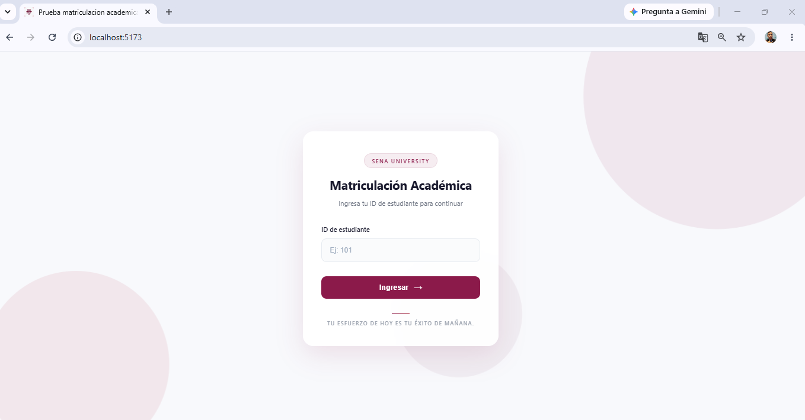
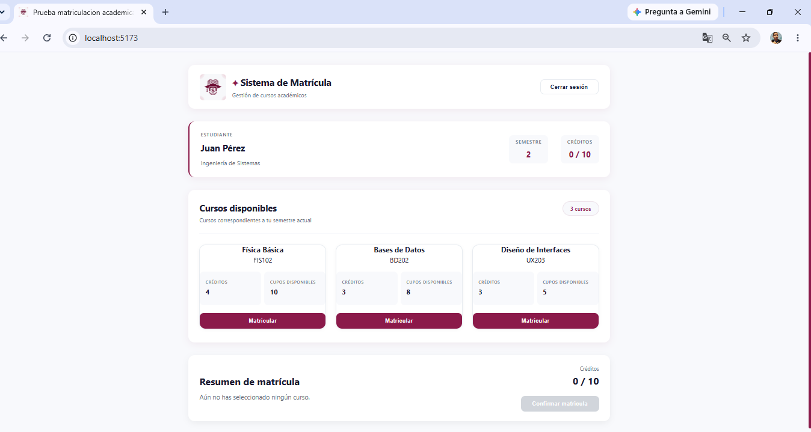

# Sistema de Matriculación Académica

## Descripción

Aplicación web para gestionar la matrícula académica de un estudiante.

El sistema permite iniciar sesión mediante el ID del estudiante, consultar los cursos disponibles según el semestre, seleccionar cursos, validar los créditos permitidos y confirmar, modificar o cancelar una matrícula.

La matrícula confirmada se almacena en `localStorage`, permitiendo conservar la información aunque se recargue la página.

## Tecnologías

- React
- Vite
- JavaScript
- HTML5
- CSS3
- JSON
- localStorage
- Oxlint
- Git y GitHub

## Funcionalidades

- Inicio de sesión mediante ID de estudiante.
- Visualización de la información del estudiante.
- Consulta de cursos disponibles.
- Visualización de código, créditos y cupos disponibles de cada curso.
- Selección y eliminación de cursos.
- Cálculo automático de créditos seleccionados.
- Confirmación de matrícula.
- Modificación de la matrícula.
- Cancelación de la matrícula.
- Persistencia de la matrícula mediante `localStorage`.
- Mensajes de error y confirmación.
- Cierre de sesión.
- Favicon personalizado.

## Validaciones

El sistema realiza diferentes validaciones antes de permitir una matrícula:

- Verifica que el ID ingresado corresponda al estudiante.
- Verifica que el estudiante esté matriculado en el periodo académico.
- Verifica que el curso tenga cupos disponibles.
- Evita seleccionar el mismo curso más de una vez.
- Evita superar el límite de créditos permitido.
- Verifica que exista al menos un curso seleccionado antes de confirmar.

## Estructura del proyecto

```text
matriculacion-academica/
│
├── public/
│   └── Favicon.png
│
├── src/
│   ├── components/
│   │   ├── CourseCard.jsx
│   │   ├── EnrollmentSummary.jsx
│   │   ├── Login.jsx
│   │   └── Login.css
│   │
│   ├── data/
│   │   ├── cursos.json
│   │   └── estudiante.json
│   │
│   ├── App.jsx
│   ├── App.css
│   ├── index.css
│   └── main.jsx
│
├── .gitignore
├── index.html
├── package.json
├── package-lock.json
└── vite.config.js

## Instalación

1: Clonar el repositorio: https://github.com/davidsamirmontanomercado-web/matriculacion-academica.git
2: Instalar las dependencias: npm install
3: Instalar las dependencias: npm run dev (La aplicación estará disponible http://localhost:5173/)

## Persistencia de datos

La matrícula confirmada se almacena utilizando localStorage. La aplicación recupera esta información al cargar nuevamente la página mediante useEffect. Para cancelar una matrícula se elimina la información almacenada localStorage.removeItem("matricula");

## Decisiones técnicas

Se utilizó React para construir la interfaz mediante componentes reutilizables y Vite como herramienta de desarrollo y construcción del proyecto. Se utilizó useState para manejar el estado de: (Usuario autenticado,Cursos seleccionados,Mensajes de error.Estado de la matrícula confirmada.)

Se utilizó useEffect para recuperar la matrícula almacenada en localStorage cuando se carga la aplicación. 

### Componentización

Con respecto a la componentización la interfaz fue dividida en componentes para facilitar su mantenimiento y reutilización:

Login: gestiona el inicio de sesión del estudiante y utiliza Login.css para sus estilos.
CourseCard: representa cada curso disponible y permite seleccionarlo o quitarlo.
EnrollmentSummary: muestra el resumen de los cursos seleccionados y las acciones de matrícula.
App: coordina el funcionamiento general de la aplicación y administra el estado principal.

## Interfaces
login 


sistema de matricula

